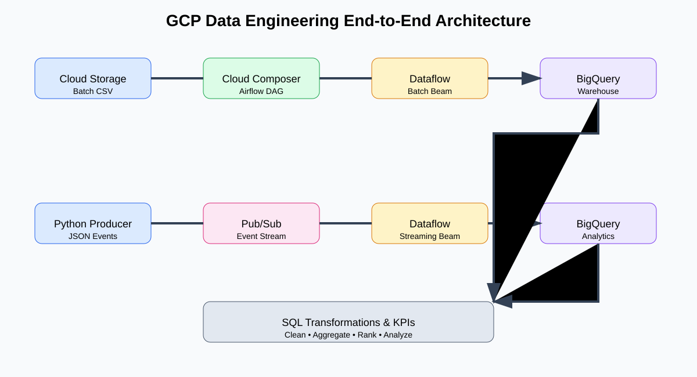

# GCP Data Engineering End-to-End Interview Project

> A hands-on Google Cloud data engineering project for learning and interview preparation.

## Project status

This repository is structured as a complete **batch + streaming** data platform using **Python, SQL, Apache Beam/Dataflow, Cloud Composer (Airflow), Pub/Sub, Cloud Storage, and BigQuery**.

## Architecture

## Data flow

**Batch:** Cloud Storage → Airflow → Dataflow → BigQuery → SQL analytics

**Streaming:** Python producer → Pub/Sub → Dataflow Streaming → BigQuery → SQL analytics

## Repository map

| Folder | Purpose |
|---|---|
| `dags/` | Airflow DAGs for orchestration |
| `dataflow/batch/` | Apache Beam batch pipeline |
| `dataflow/streaming/` | Apache Beam streaming pipeline |
| `dataflow/common/` | Reusable Python transformations |
| `producer/` | Python Pub/Sub event producer |
| `sql/ddl/` | BigQuery datasets and table definitions |
| `sql/transformations/` | Cleaning and business transformations |
| `sql/analytics/` | Interview-focused analytical SQL |
| `data/` | Small sample batch and streaming data |
| `tests/` | Pipeline unit tests |
| `scripts/` | GCP setup and upload helpers |
| `architecture/` | Detailed architecture notes |
| `docs/screenshots/` | Architecture and flow visuals |

## What you will learn

1. How an Airflow DAG orchestrates a Dataflow job.
2. How Dataflow/Apache Beam reads, transforms, validates, and writes data.
3. How batch pipelines differ from streaming pipelines.
4. How Pub/Sub feeds a streaming Dataflow pipeline.
5. How BigQuery is used as an analytical warehouse.
6. How SQL is used for cleansing, KPI calculations, and analytics.
7. How to explain the complete architecture in a data engineering interview.

## Important note

The repository is intentionally written as a **learning project**. Every important Python and SQL file contains comments explaining the purpose of the code, the data flow, and the GCP concept being demonstrated.
