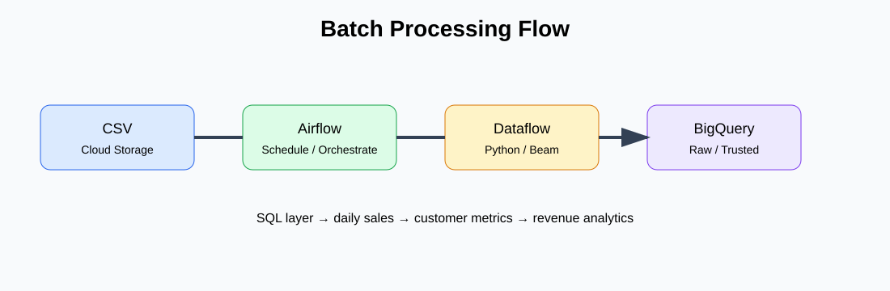
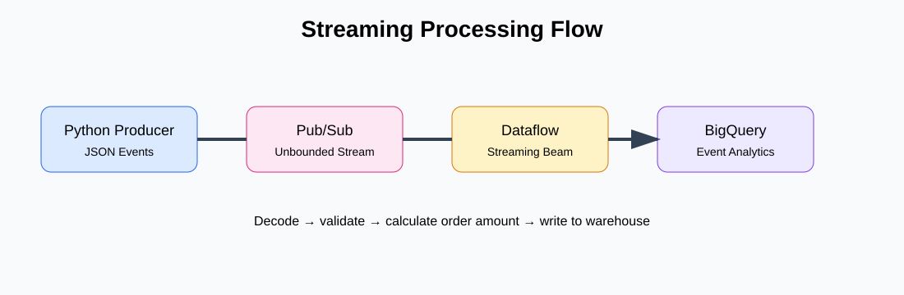

# GCP Data Engineering End-to-End Interview Project

> A hands-on Google Cloud data engineering project for learning, practice, and interview preparation.

## 🎯 Project objective

Build and understand a realistic **end-to-end GCP data platform** using only **Python and SQL** for application and transformation logic.

The project demonstrates both:

- **Batch processing**
- **Real-time / streaming processing**

Core services:

**Cloud Storage • Cloud Composer / Airflow • Dataflow / Apache Beam • Pub/Sub • BigQuery**

---

## 🏗️ End-to-End Architecture

### Overall flow

**Batch**

Cloud Storage → Cloud Composer / Airflow → Dataflow Batch → BigQuery → SQL Analytics

**Streaming**

Python Producer → Pub/Sub → Dataflow Streaming → BigQuery → SQL Analytics

---

## 📸 Batch Processing Flow

### What happens?

1. Sample order data is stored as CSV.
2. The CSV is uploaded to **Cloud Storage**.
3. **Cloud Composer / Airflow** schedules the batch workflow.
4. Airflow launches the **Python Apache Beam pipeline**.
5. **Dataflow** reads and transforms the data.
6. Cleaned records are written to **BigQuery**.
7. SQL creates trusted analytical tables and KPIs.

---

## 📸 Streaming Processing Flow

### What happens?

1. The Python producer creates order events.
2. Events are published to **Pub/Sub**.
3. **Dataflow Streaming** continuously consumes the subscription.
4. Python transformations decode and enrich each event.
5. Events are written to **BigQuery**.
6. SQL can then be used for real-time-oriented analytics.

---

# 📁 Repository File Guide

## 1. `config/config.py`

Central configuration for:

- GCP project ID
- GCP region
- Cloud Storage bucket
- Pub/Sub topic/subscription
- BigQuery dataset

**Interview concept:** configuration management and runtime parameters.

---

## 2. `data/batch/orders.csv`

Small sample batch dataset containing:

- Order ID
- Customer ID
- Order timestamp
- Product
- Quantity
- Price
- Status
- City

This makes the repository easy to understand without requiring a large external dataset.

---

## 3. `data/streaming/order_events.json`

Sample JSON events used by the streaming producer.

Each event represents an order arriving in real time.

---

# ⚙️ Dataflow / Apache Beam

## 4. `dataflow/common/transforms.py`

Contains reusable Python transformations.

Examples:

- Parse CSV records
- Clean values
- Calculate order amount
- Decode Pub/Sub JSON events

This file demonstrates how to keep transformation logic reusable.

---

## 5. `dataflow/batch/batch_orders_pipeline.py`

The main **batch Dataflow pipeline**.

Flow:

`Cloud Storage CSV → Parse → Clean → BigQuery`

Important concepts:

- `PipelineOptions`
- `PCollection`
- `ParDo`
- `BigQueryIO`
- Error handling
- Batch processing

---

## 6. `dataflow/streaming/streaming_orders_pipeline.py`

The main **streaming Dataflow pipeline**.

Flow:

`Pub/Sub → Decode → Transform → BigQuery`

Important concepts:

- Unbounded data
- Pub/Sub source
- Streaming mode
- `ParDo`
- BigQuery sink
- Error handling / dead-letter design

---

# 🔄 Airflow / Cloud Composer

## 7. `dags/batch_orders_dag.py`

Schedules the batch Dataflow pipeline.

It demonstrates:

- DAG definition
- Scheduling
- Runtime configuration
- Dataflow orchestration
- Job naming

**Key interview point:**

> Airflow is the orchestration layer; Dataflow is the distributed processing engine.

---

## 8. `dags/streaming_pipeline_dag.py`

Demonstrates deployment of the long-running streaming Dataflow job.

The DAG is manually triggered because a streaming Dataflow job normally remains active instead of running once per day.

---

# 📬 Pub/Sub Producer

## 9. `producer/publish_order_events.py`

Python program that publishes JSON events to Pub/Sub.

Flow:

`JSON → Python → Pub/Sub Topic → Dataflow`

This is useful for understanding how an application can become the source of a streaming data platform.

---

# 🗄️ BigQuery SQL

## 10. `sql/ddl/create_datasets.sql`

Creates the BigQuery dataset.

**Concepts:**

- Dataset
- Region
- Metadata description

---

## 11. `sql/ddl/create_tables.sql`

Creates the raw batch and streaming tables.

Demonstrates:

- Data types
- Partitioning
- Clustering
- Raw/landing layer design

---

## 12. `sql/transformations/clean_orders.sql`

Creates a trusted order table.

Demonstrates:

- Data cleansing
- `TRIM`
- `UPPER`
- `INITCAP`
- Validation
- Derived metrics

---

## 13. `sql/transformations/daily_sales.sql`

Calculates daily business KPIs.

Examples:

- Total orders
- Completed orders
- Cancelled orders
- Revenue
- Average order value

---

## 14. `sql/analytics/customer_analysis.sql`

Customer-level analytics using:

- CTEs
- Aggregations
- `DENSE_RANK()`
- Customer segmentation
- Window functions

---

## 15. `sql/analytics/revenue_analysis.sql`

Product revenue analysis.

Demonstrates:

- Aggregation
- Window functions
- Revenue contribution percentage
- `SAFE_DIVIDE`

---

# 🧪 Testing

## 16. `tests/test_transforms.py`

Unit tests for Python transformation logic.

The tests demonstrate the basic:

**Arrange → Act → Assert**

pattern without requiring a live GCP environment.

---

# 🛠️ Deployment / Setup

## 17. `scripts/setup_gcp.sh`

Example GCP setup script.

It demonstrates how to:

- Select a GCP project
- Enable required APIs
- Create a Cloud Storage bucket
- Create a Pub/Sub topic
- Create a Pub/Sub subscription

---

## 18. `scripts/upload_data.sh`

Uploads:

- Batch data
- Dataflow Python files

to Cloud Storage.

---

# 📚 Architecture Notes

## 19. `architecture/architecture.md`

Contains detailed explanations and interview questions covering:

- Batch vs streaming
- Airflow vs Dataflow
- Pub/Sub
- BigQuery
- PCollection
- Dead-letter queues
- Idempotency
- Partitioning
- Clustering
- Monitoring
- Query optimization

This should be one of the first files to read while preparing for interviews.

---

# 🧠 Recommended Learning Order

If you are using this repository specifically for **Data Engineering interview preparation**, follow this order:

### Step 1 — Understand the architecture

Read:

`architecture/architecture.md`

Then study:

`docs/screenshots/end_to_end_architecture.svg`

### Step 2 — Learn batch processing

Read:

`data/batch/orders.csv`

→ `dataflow/common/transforms.py`

→ `dataflow/batch/batch_orders_pipeline.py`

→ `dags/batch_orders_dag.py`

### Step 3 — Learn BigQuery

Read:

`sql/ddl/create_tables.sql`

→ `sql/transformations/clean_orders.sql`

→ `sql/transformations/daily_sales.sql`

→ `sql/analytics/customer_analysis.sql`

### Step 4 — Learn streaming

Read:

`data/streaming/order_events.json`

→ `producer/publish_order_events.py`

→ `dataflow/streaming/streaming_orders_pipeline.py`

→ `dags/streaming_pipeline_dag.py`

### Step 5 — Practice explaining the architecture

Try to explain this without looking at the README:

`Source → Ingestion → Processing → Storage → Transformation → Analytics`

---

# 🎤 Interview Explanation

A concise way to explain this project:

> "I built an end-to-end GCP data engineering pipeline supporting both batch and streaming workloads. Cloud Composer orchestrates the workflows, Dataflow processes data using Apache Beam and Python, Pub/Sub handles streaming events, Cloud Storage acts as the batch landing layer, and BigQuery serves as the analytical warehouse. I used SQL for data cleansing, KPI calculations, customer analytics, and revenue analysis."

---

# 🔑 Key Interview Topics Covered

| Topic | Demonstrated In |
|---|---|
| Python | Dataflow, producer, configuration |
| SQL | DDL, transformations, analytics |
| Apache Beam | Batch and streaming pipelines |
| Dataflow | Batch + streaming processing |
| Airflow | DAG orchestration |
| Cloud Composer | Managed Airflow concept |
| Pub/Sub | Streaming ingestion |
| Cloud Storage | Batch landing |
| BigQuery | Warehouse + analytics |
| Partitioning | BigQuery DDL |
| Clustering | BigQuery DDL |
| Window Functions | Customer/revenue SQL |
| CTEs | Analytics SQL |
| Error Handling | Dataflow transformations |
| Unit Testing | Python tests |
| Data Quality | Validation and cleansing |

---

# ⚠️ Important

This repository is intentionally designed as a **learning/interview project**.

The code contains detailed comments explaining **what the code does, why it is needed, and which GCP/Data Engineering concept it demonstrates**.

Before deploying to a real GCP project, replace all `YOUR_GCP_PROJECT_ID` and `YOUR_GCS_BUCKET` placeholders and configure appropriate IAM permissions.

Never commit service-account keys or other secrets to GitHub.

