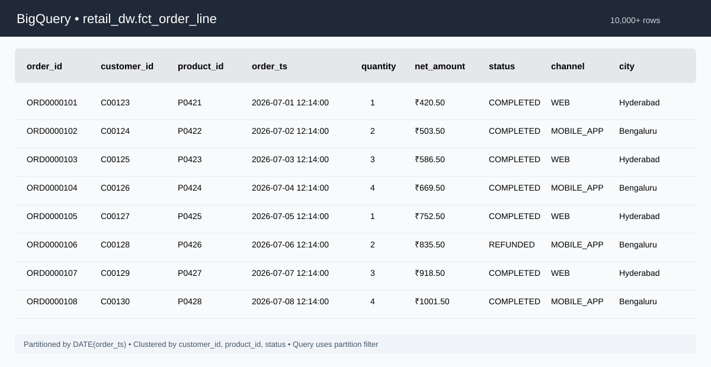
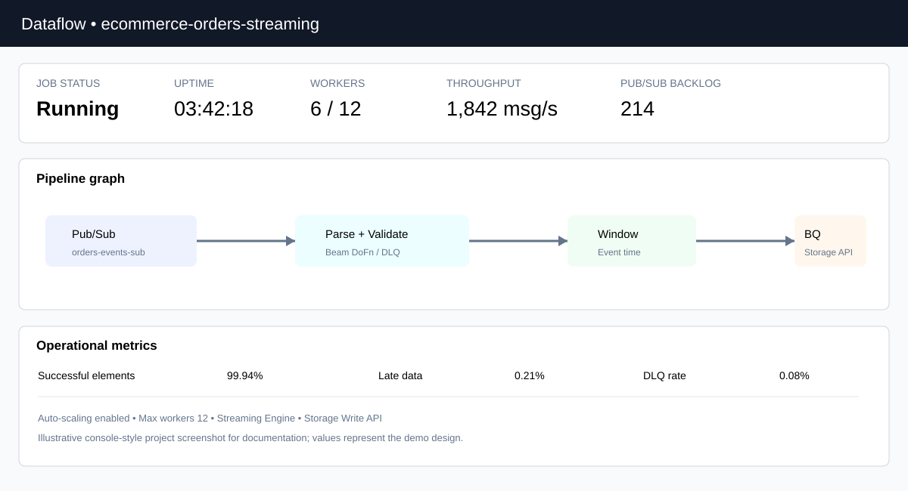
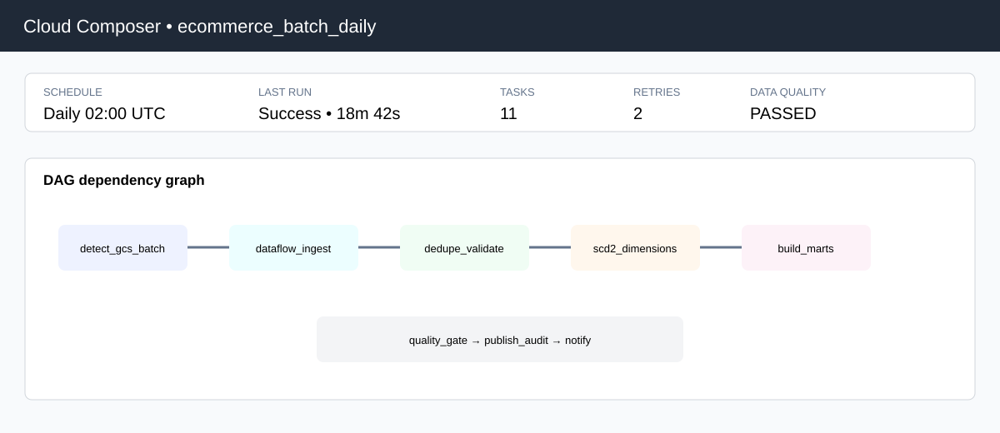

# GCP Data Engineering — Production Portfolio Project

A production-style Google Cloud data platform designed to demonstrate the responsibilities and engineering decisions expected from a Data Engineer with around 4 years of experience.

## Project scenario

An e-commerce business receives order data from web, mobile, marketplace and store channels. The platform supports scheduled batch processing and near-real-time order events.

| Layer | Technology | Responsibility |
|---|---|---|
| Landing | Cloud Storage | Durable batch landing and replay |
| Orchestration | Cloud Composer / Airflow | Scheduling, dependencies and retries |
| Batch | Dataflow / Apache Beam | Distributed ingestion and validation |
| Streaming | Pub/Sub + Dataflow | Event-time processing and late data |
| Warehouse | BigQuery | Raw, staging, dimensional and fact models |
| Analytics | BigQuery marts | Customer and commercial KPIs |
| Observability | BigQuery | Pipeline audit and operational metrics |

## Architecture

**Batch:** Cloud Storage → Composer → Dataflow → RAW → DQ/Dedup → DW → MART

**Streaming:** Application → Pub/Sub → Dataflow → event-time windows → BigQuery → streaming marts

## Dataset

This repository uses a medium-sized deterministic synthetic workload instead of a tiny tutorial dataset.

| Dataset | Volume | Purpose |
|---|---:|---|
| Orders | 10,000 order-line records | Batch fact ingestion |
| Customers | 500 records | Customer dimension / SCD2 |
| Products | 120 records | Product dimension |
| Streaming events | 5,000 JSONL events | Pub/Sub replay workload |
| Order files | 4 partitions | Multi-file landing simulation |
| Event files | 2 partitions | Replay/chunk simulation |

The records are original synthetic data generated for this repository. No company production data is included.

## Production engineering patterns

### Deterministic deduplication
order_line_id is the business key. The latest source version wins using updated_at and ingestion time.

### Data-quality quarantine
Invalid records are captured with the original record and rule-level failure reason instead of being silently dropped.

### SCD Type 2
Customer history is preserved using effective_from, effective_to, is_current and record_hash.

### BigQuery performance
The order fact is partitioned by order date and clustered by high-value filtering dimensions.

### Streaming event time
The streaming Dataflow pipeline assigns event timestamps, supports bounded lateness and separates invalid events from valid traffic.

### Operational auditability
Pipeline runs can record run ID, row counts, rejected rows, duplicate counts, target table, Dataflow job ID, status and error details.

### Replay and backfill
Raw landing data and event files are retained so historical partitions can be replayed without rebuilding the entire warehouse.

## Console-style documentation views

### BigQuery

### Dataflow

### Cloud Composer

> These are illustrative console-style documentation visuals created for the repository. They are not screenshots from a live production GCP account.

## Repository structure

    MyGcp_Data_Engineering_projects/
    ├── architecture/
    │   └── production_design.md
    ├── config/
    ├── dags/
    │   └── retail_orders_production_dag.py
    ├── data/
    │   ├── README.md
    │   ├── generate_medium_dataset.py
    │   └── medium/
    ├── dataflow/
    │   ├── batch/
    │   │   └── batch_orders_pipeline.py
    │   ├── common/
    │   └── streaming/
    │       └── streaming_orders_pipeline.py
    ├── docs/
    ├── producer/
    ├── scripts/
    ├── sql/
    ├── tests/
    ├── requirements.txt
    └── README.md

There are no beginner/demo pipeline variants in the final project structure.

## Key SQL assets

| Area | File | Purpose |
|---|---|---|
| Warehouse model | sql/ddl/create_enterprise_model.sql | RAW/STG/DW/MART/OPS model |
| Deduplication | sql/transformations/deduplicate_orders.sql | Latest-record selection |
| Data quality | sql/transformations/data_quality_orders.sql | Validation and quarantine |
| SCD2 | sql/dimensions/customer_scd2_merge.sql | Historical customer versions |
| Customer mart | sql/marts/customer_360.sql | Customer-level analytics |
| KPI mart | sql/marts/daily_commercial_kpis.sql | Daily commercial KPIs |
| Streaming mart | sql/streaming/sessionized_orders.sql | Event-time streaming metrics |
| Operations | sql/operations/pipeline_audit.sql | Pipeline observability |

## Interview scenarios

| Scenario | Engineering response |
|---|---|
| Same landing file arrives twice | Business-key deduplication and idempotent writes |
| Source sends invalid rows | Quarantine with rule-level reason |
| Customer attributes change | SCD Type 2 |
| Streaming events arrive late | Event-time windows + allowed lateness |
| Pub/Sub backlog grows | Inspect bottleneck and scale Dataflow |
| Dataflow task fails | Retry failed work and use audit metadata |
| BigQuery scans too much data | Partition pruning + clustering |
| Historical data needs reprocessing | Raw retention + partition-scoped backfill |
| Business needs customer value | Customer 360 mart |
| Operations needs run status | Pipeline audit table |

## Deployment outline

1. Create the GCP project, bucket, Pub/Sub topic/subscription and BigQuery datasets.
2. Configure Composer variables and service-account permissions.
3. Upload the SQL and Dataflow code as part of the deployment package.
4. Run sql/ddl/create_enterprise_model.sql.
5. Land the medium dataset in Cloud Storage.
6. Start the Composer DAG for the batch path.
7. Deploy the streaming Dataflow pipeline and publish events with producer/publish_order_events.py.
8. Monitor Dataflow, Pub/Sub backlog, BigQuery and pipeline audit records.

Replace placeholders such as YOUR_GCP_PROJECT_ID before deployment. Never commit credentials or service-account keys.

## References

- https://cloud.google.com/dataflow/docs
- https://cloud.google.com/bigquery/docs
- https://cloud.google.com/pubsub/docs
- https://github.com/GoogleCloudPlatform/dataflow-cookbook
- https://github.com/GoogleCloudPlatform/DataflowTemplates

The architecture is adapted for this portfolio project; the dataset itself is original synthetic data.
